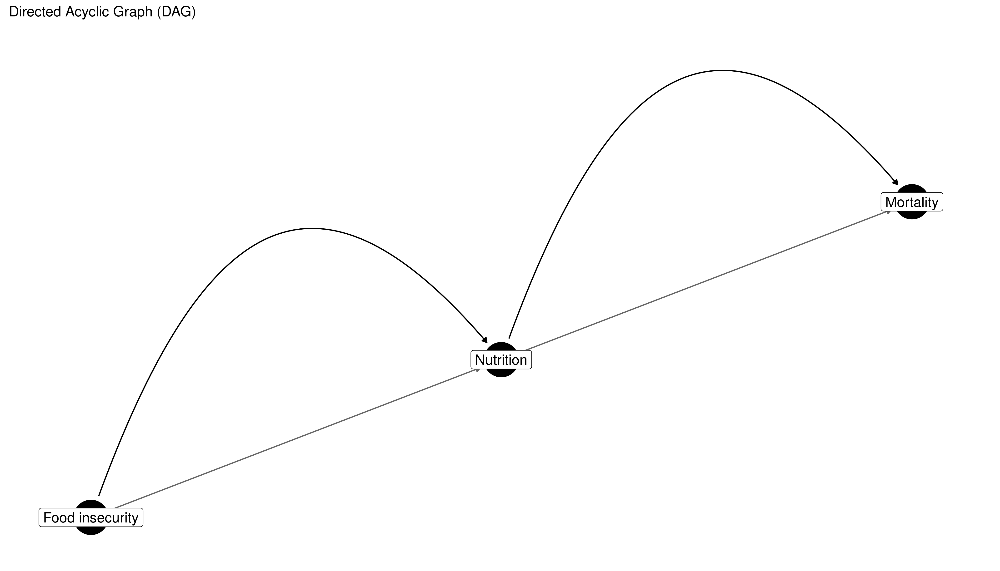
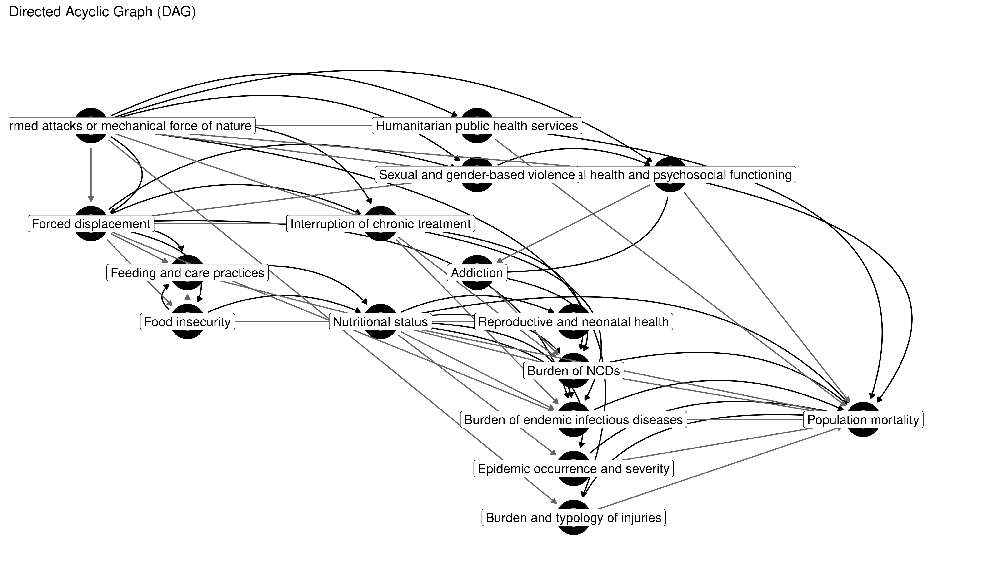

<!-- README.md is generated from README.Rmd. Please edit that file -->

# nurah

<!-- badges: start -->

[](https://www.repostatus.org/#wip)
[](https://app.codecov.io/gh/OJWatson/nurah)
[](https://github.com/OJWatson/nurah/actions/workflows/R-CMD-check.yaml)
<!-- badges: end -->

`nurah` is an R package designed as a research compendium to evaluate
the feasibility of estimating mortality in humanitarian crises. It
leverages statistical modelling, directed acyclic graphs (DAGs), and
simulations to address data availability challenges, producing robust
and actionable mortality estimates.

## Overview

`nurah` facilitates:

1.  Defining causal structures for mortality estimation using DAGs.
2.  Simulating crisis-affected population data based on defined DAGs.
3.  Estimating indirect mortality through Bayesian hierarchical models
    informed by the causal DAG.

## Installation

Install the latest version from GitHub:

``` r
# install.packages("devtools")
devtools::install_github("OJWatson/nurah")
```

## Usage

### Defining a DAG

Start by defining your causal structure with predictors and an outcome
(mortality):

``` r
library(nurah)

nodes <- c("Nutrition", "\"Food insecurity\"", "Mortality")
edges <- data.frame(
  from = c("\"Food insecurity\"", "Nutrition"),
  to = c("Nutrition", "Mortality")
)

dag <- define_dag(nodes, edges)
visualise_dag(dag)
```

<!-- -->

### Specifying Parameters

You can add specific parameter values (effect sizes and lags) to your
DAG:

``` r
parameters <- data.frame(
  from = c("\"Food insecurity\"", "Nutrition"),
  to = c("Nutrition", "Mortality"),
  effect_size = c(-0.5, 1.2),
  lag = c(30, 0)
)

dag <- define_dag(nodes, edges, parameters)
```

### Using Checchi et al. (2017) DAG

A core inspiration for `nurah` is the DAG from Checchi et al. (2017).
You can quickly use this predefined DAG:

``` r
dag <- checchi_2017_dag()
visualise_dag(dag, label_size = 4.5)
```

<!-- -->

``` r
# Dummy parameters for demonstration
parms <- dummy_checchi_2017_parameters()
dag <- checchi_2017_dag(parameters = parms)
head(parms)
#>                                                      from
#> 1 Exposure to armed attacks or mechanical force of nature
#> 2 Exposure to armed attacks or mechanical force of nature
#> 3 Exposure to armed attacks or mechanical force of nature
#> 4 Exposure to armed attacks or mechanical force of nature
#> 5 Exposure to armed attacks or mechanical force of nature
#> 6 Exposure to armed attacks or mechanical force of nature
#>                                           to effect_size lag
#> 1                        Forced displacement         0.2   0
#> 2          Interruption of chronic treatment         0.3  14
#> 3           Sexual and gender-based violence         0.4  14
#> 4            Burden and typology of injuries         1.2   0
#> 5 Mental health and psychosocial functioning         0.2  30
#> 6        Humanitarian public health services        -0.5   0
```

### Simulating Data

Use your DAG to simulate crisis data with defined spatial and temporal
structures:

N.B. WARNING - Currently this does not set any values in your DAG if the
parent nodes have no values! (TODO List)

``` r
sim_data <- simulate_crisis_data(
  dag,
  start_date = "2020-01-01",
  n_periods = 6,
  resolution = "month",
  spatial_structure = data.frame(
    country = "X", region = c("A","B"), district = c("A1","B1")
  ),
  initial_population = 10000,
  noise_level = 0.8
)
```

### Fitting Hierarchical Model

Fit a Bayesian hierarchical model to estimate indirect mortality using
simulated data:

``` r
fit <- fit_dag(
  data = sim_data,
  dag = dag,
  outcome = "Population mortality",
  spatial_levels = c("region", "district"),
  iter = 1000,
  chains = 2
)

summary(fit)
```

### Other Features To Describe/Finish/Test:

- Simulating missingness in data observation (MCAR, MAR, MNAR) (https://github.com/OJWatson/nurah/tree/missingess/proxies)
- Simulating proxies - data that is hoped to reflect a node but may have different effect size or directionality to node (https://github.com/OJWatson/nurah/tree/missingess/proxies)
- Aggregation (how data collected at different spatial or temporal resolution could be aggregated and impact on model identifiability)
- Custom model formula into model fit
- Model summary plots and summaries for assessing identifiability against DAG
- Identify where to pull in http://robindenz1.github.io/simDAG/index.html or keep distinct


## Getting Help

For issues, feature requests, or support, please open an issue on
GitHub:

- [GitHub Issues](https://github.com/OJWatson/nurah/issues)

## References

- Checchi et al. (2017). [“Public health information in crisis-affected
  populations”](https://journals.plos.org/plosmedicine/article?id=10.1371/journal.pmed.1002181).
  *PLOS Medicine.*
